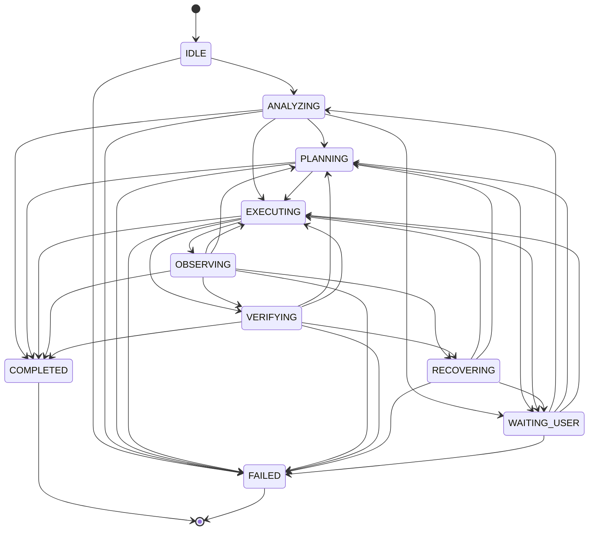
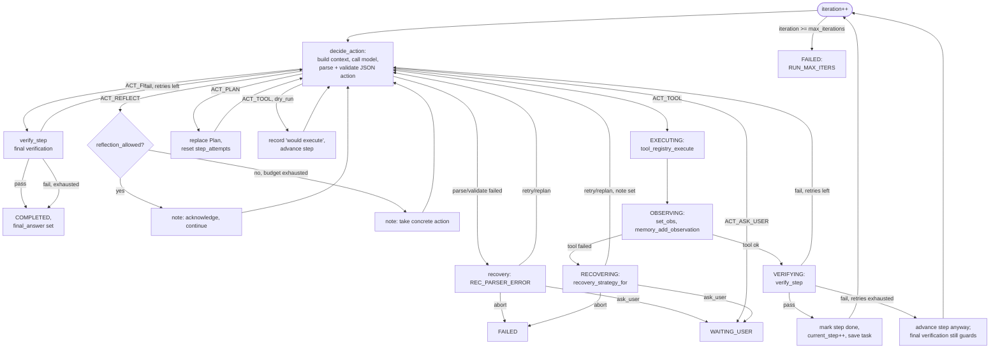

# The Agent Loop and State Machine

## State machine

`agent/core/state.h` defines ten states. `agent_state_transition()` in
`agent/core/state.c` is a guarded transition function: it consults a static
adjacency table (`allowed()`), applies the move only if legal, and otherwise logs a
warning and leaves the state unchanged. This makes an illegal jump (e.g.
`COMPLETED -> EXECUTING`) a caught bug rather than a silent corruption. Terminal
states (`COMPLETED`, `FAILED`) are sticky — no transition out of them is permitted.

Every state also self-loops (re-entering the same state is always allowed; omitted
above for clarity). Note the direct `EXECUTING -> VERIFYING -> COMPLETED` path: a
`final` action proposed while still nominally "executing" goes straight to final
verification without an intervening `OBSERVING` step, because there is no tool
observation to make — the model is claiming completion, and the loop checks that
claim before accepting it.

## Per-task flow

`agent_loop_run()` (in `agent/core/agent_loop.c`) drives one `AgentTask` to a
terminal outcome (`RUN_COMPLETED`, `RUN_FAILED`, `RUN_NEEDS_USER`, or
`RUN_MAX_ITERS`). Setup, in order:

1. Initialize `Memory` (short-term ring, size 16) and `ReflectionBudget`
   (`cfg.max_reflections`), build the tool description block.
2. Emit `EV_TASK_STARTED`; persist the task row if a database is attached.
3. If the task has no plan yet: `ANALYZING -> PLANNING`, call `planner_make_plan()`
   (recalls relevant memory first), persist the plan, emit `EV_PLAN_CREATED`.
   If resuming a task that already has a plan, re-parse it instead of replanning.
4. If `RunOptions.plan_only` is set, stop here: the plan itself becomes the
   `final_answer` and the task is marked `COMPLETED` without executing anything
   (`--plan` on the CLI).
5. Otherwise `-> EXECUTING` and enter `loop_body()`.

## The per-iteration cycle (`loop_body`)

Key mechanics visible in `agent_loop.c`:

- **`decide_action`** builds a `ContextParts` (system prompt, goal, state name,
  serialized plan, tools description, `memory_recall(goal, 6)`,
  `memory_recent_observations(4000 chars)`, current step description, and an
  optional recovery/reflection note), hands it to `context_build()`, calls
  `backend->generate()`, then runs the model text through `agent_action_parse()`
  (extract → repair) and `agent_action_validate()` against the live tool name
  list. A model or parse failure is treated as `REC_PARSER_ERROR` and goes through
  the same recovery path as a tool failure.
- **`run_tool`** always calls through `tool_registry_execute` (never a raw
  function pointer), logs the call to the database, and captures `exit_code` from
  the tool's structured `data` payload (used by `exit_zero` verification).
- **`verify_step`** looks at the current plan step's `verification` spec
  (`"kind:arg"`, e.g. `file_exists:hello.c` or `exit_zero`); a step with no spec
  passes trivially. This is deterministic structural verification, not a model
  judgment call.
- **`do_recovery`** classifies the failure (`RecoveryClass`), increments
  `step_attempts`, and asks `recovery_strategy_for(cls, attempts, max_retries)` for
  one of `STRAT_RETRY`, `STRAT_REPLAN`, `STRAT_ASK_USER`, `STRAT_ABORT`, composing a
  note fed back into the next `decide_action` call.
- On success, `RUN_COMPLETED` also triggers `memory_record_procedure()` — the
  finished plan is stored as a reusable procedure keyed by `"goal:<goal text>"`.

`agent_loop_resume()` re-enters `loop_body` after a `WAITING_USER` stop: it clears
`requires_user_input`, logs the user's answer as a message, force-transitions a
terminal state back to `EXECUTING` if needed (a task can only be resumed if it
actually stopped waiting), and feeds the answer in as the initial recovery note.

## Bounded reflection

`ReflectionBudget` (`agent/reasoning/reflection.h`) is reset every new step
(`reflection_reset`) and capped at `cfg.max_reflections` (default 2). An
`ACT_REFLECT` action consumes one unit via `reflection_allowed()`; once exhausted,
the loop stops acknowledging reflections and instead tells the model "Enough
reflection. Take a concrete action now." This guarantees the loop cannot spin
indefinitely in self-reflection instead of making progress.

## "Runtime decides, model proposes" (build prompt §57)

The model's only power is to emit one JSON object per turn, chosen from exactly
five action types. Every one of those proposals passes through code the model
cannot influence:

- **Parsing**: `agent_action_parse` extracts/repairs JSON; malformed output never
  reaches execution — it's coerced to `ACT_INVALID` and handled as a recoverable
  error.
- **Validation**: `agent_action_validate` checks the action type is coherent, that
  a requested tool exists in the live registry, and that required fields are
  present.
- **Execution gating**: `tool_registry_execute` re-checks tool existence,
  permission enablement, confirmation requirements (security level × autonomy ×
  approval mode), and only then calls the tool's C function.
- **Structural verification**: `verify_check` inspects real filesystem/exit-code
  state, not the model's claim about what happened.

No step in this chain trusts the model's self-report. See `docs/agent/security.md`
for the permission/autonomy details and `docs/agent/tools.md` for the protocol
grammar and validation order.
