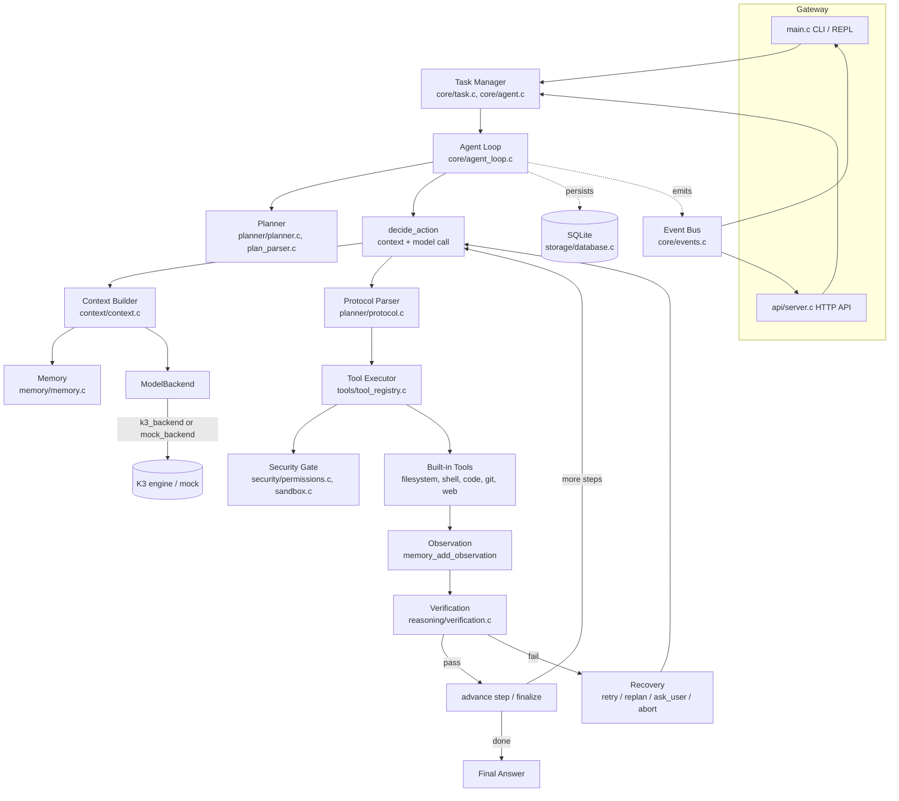

# Agent Architecture

## Two layers, one strict boundary

`kimi-k3-in-c` has two independent halves that share a repository but never share
headers in the wrong direction:

| Layer | Location | What it is |
|---|---|---|
| **Model** | `include/k3/`, `src/`, `third_party/tok*.h` | The Kimi K3 kernel library and its oracle-validated CLI (`k3_run.c`). Pure inference: tokenize, prefill/decode, sample. Untouched by the agent work. |
| **Agent runtime** | `agent/`, `config/`, `tests/agent/` | Everything that turns a raw text-completion model into a task-executing agent: state machine, planner, tools, memory, security, context assembly, HTTP API. |

The agent runtime **never includes a `k3/*.h` header**. Its only view of "a model" is
the `ModelBackend` vtable in `agent/model/model_interface.h`:

```c
typedef struct ModelBackend {
    const char *name;
    int  (*initialize)(struct ModelBackend *self);
    int  (*generate)(struct ModelBackend *self, const K3GenerationRequest *req,
                     K3GenerationResult *res);
    void (*shutdown)(struct ModelBackend *self);
    int  (*count_tokens)(struct ModelBackend *self, const char *text);
    int   context_window;
    void *ctx;
} ModelBackend;
```

Three implementations satisfy this vtable today:

- **`k3_backend.c`** — adapts `agent/model/k3_engine.c` (a reusable generation
  session built on the same public K3 APIs the CLI uses: `k3_st`, `k3_bind`/`k3_trunk`,
  `k3_cache`, `k3_decoder_layer_inc`, the tokenizer) to `ModelBackend`. It exists
  because `k3_run.c`'s forward loop is `static`, greedy-only, and load-once/decode-once/exit
  — the agent needs load-once/generate-many with sampling, stop strings, and streaming.
  `k3_run.c` is never modified; `test_k3_engine` gates the two forward paths against
  each other on a tiny checkpoint so drift is a test failure, not a silent bug.
- **`mock_backend.c`** — a deterministic, scripted backend (FIFO-queued responses or
  a JSON script file) used by all 21 agent tests and for reproducible CLI demos.
- A remote-API backend could be added later purely by implementing this vtable;
  nothing else in the agent would change.

## Component flow



The runtime, not the model, decides whether a proposed action is valid and
permitted ("runtime decides, model proposes" — see `docs/agent/agent-loop.md`).
The model only ever proposes one of five JSON actions (`tool`, `final`, `ask_user`,
`plan`, `reflect`); `agent_action_parse` + `agent_action_validate` +
`tool_registry_execute` are the only code paths that turn a proposal into a side
effect.

## Directory map

```
agent/
  core/        agent.{h,c} (owns backend/tools/security/db), agent_loop.{h,c} (state
               machine loop), state.{h,c} (AgentState + legal-transition table),
               task.{h,c} (AgentTask), config.{h,c} (AgentConfig + defaults/loader),
               events.{h,c} (EventBus)
  model/       model_interface.h (the ModelBackend boundary), k3_engine.{h,c}
               (reusable K3 generation session), k3_backend.{h,c} (adapter),
               mock_backend.{h,c} (scripted test backend)
  planner/     protocol.{h,c} (strict JSON action grammar), plan_parser.{h,c}
               (Plan/PlanStep parse+validate+serialize), planner.{h,c}
               (goal -> Plan, with fallback synthesis)
  tools/       tool.h (AgentTool/ToolResult/ToolContext), tool_registry.{h,c}
               (registration + validated execute), filesystem.c, shell.c, code.c,
               git.c, web.c (the built-in tools)
  memory/      memory.{h,c} — short-term ring (RAM) + episodic/semantic/procedural
               (SQLite-backed) recall
  reasoning/   verification.{h,c} (RecoveryClass, VerifyCheck, verify_check),
               reflection.{h,c} (bounded ReflectionBudget)
  security/    permissions.{h,c} (per-tool policy, autonomy levels, approval modes),
               sandbox.{h,c} (path confinement, backup/rollback)
  context/     context.{h,c} — assembles and budgets the model prompt
  storage/     database.{h,c}, schema.sql — SQLite persistence
  api/         server.{h,c} — loopback-only HTTP control plane
  util/        buf.c (growable string buffer), log.c, platform.c (fs/proc
               abstraction), jsonx.c (cJSON accessor helpers)
  prompts/     system.txt — the fixed system prompt
  main.c       k3-agent CLI: flags, REPL, slash commands, event printer

config/        agent.json (AgentConfig), permissions.json (per-tool policy),
               tools.json (security-level reference/documentation)
tests/agent/   21 tests (agent_test_util .. agent_test_k3_engine), test_util.h
docs/agent/    this documentation set + analysis.md (the Phase 0 analysis)
```

Build wiring lives in `agent/agent.cmake` (included from the top-level
`CMakeLists.txt`): a static `agent_core` library links `agent/**/*.c` against `k3`
(the model library), vendored `agent_cjson`, and vendored `agent_sqlite`; the
`k3_agent` executable (output name `k3-agent`) links `agent_core` and is just
`agent/main.c`.
