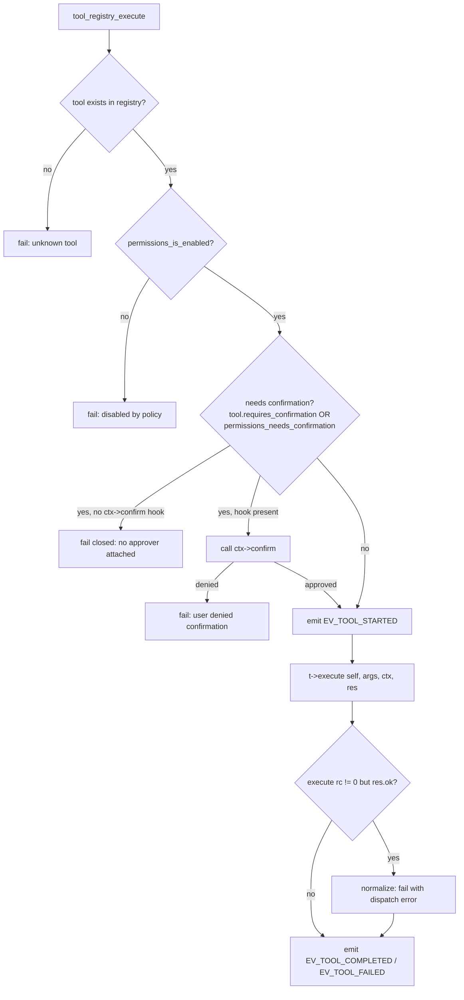

# Tools

## The interface

`agent/tools/tool.h` defines the generic tool contract. A tool never runs unless it
passes through the registry — the model itself never calls a C function directly.

```c
typedef enum {
    SEC_SAFE = 0,     /* read-only, no side effects */
    SEC_LOW_RISK,     /* creates/edits inside the sandbox */
    SEC_MEDIUM_RISK,  /* runs commands */
    SEC_HIGH_RISK,    /* deletes, destructive fs ops */
    SEC_CRITICAL      /* system configuration */
} SecurityLevel;

typedef struct {
    int    ok;
    char  *output;        /* human/model-readable text */
    int    truncated;
    char  *error;
    int    error_class;   /* a RecoveryClass */
    cJSON *data;          /* optional structured payload (e.g. exit_code) */
} ToolResult;

typedef struct ToolContext {
    const char *workspace;
    int         sandbox_enabled;
    void       *sandbox;       /* Sandbox* */
    void       *permissions;   /* Permissions* */
    int  (*confirm)(const char *tool, SecurityLevel lvl, const char *summary, void *ud);
    void  *confirm_ud;
    void  *events;             /* EventBus*, optional */
    const char *task_id;
} ToolContext;

typedef struct AgentTool {
    const char   *name;
    const char   *description;
    const char   *args_schema;      /* shown to the model verbatim */
    SecurityLevel security_level;
    int           requires_confirmation;
    int  (*execute)(const struct AgentTool *self, const cJSON *args,
                    ToolContext *ctx, ToolResult *res);
    void *state;
} AgentTool;
```

No tool is required to enforce security itself beyond what its `execute()` does
internally (e.g. `shell_execute`'s denylist); the security level and the registry
gate are the primary control, with tool-level checks (sandbox path resolution,
shell pattern matching, URL safety) as defense in depth.

## The registry

`agent/tools/tool_registry.c` holds a fixed array (`MAX_TOOLS = 64`). Registration
is name-unique and shallow-copies the `AgentTool` struct. `tool_registry_register_builtins()`
calls each tool file's registration entry point (`fs_tools_register`,
`shell_tool_register`, `code_tools_register`, `git_tools_register`,
`web_tools_register`).

### `tool_registry_execute` validation order



`tool_registry_execute` always fills `res` (never leaves it in a nondescript
state), so the caller can inspect `res->ok` regardless of which stage rejected the
call. When confirmation is required but no `confirm` hook is attached to the
context, the registry **fails closed** — it refuses the tool rather than silently
skipping confirmation.

## The strict JSON action protocol

`agent/planner/protocol.h` defines the five actions a model turn may emit — exactly
one JSON object, nothing else:

| Action | Shape | Required fields |
|---|---|---|
| `tool` | `{"action":"tool","tool":"NAME","arguments":{...},"expected_result":"..."}` | `tool` (must exist in registry), `arguments` (object, may be empty) |
| `final` | `{"action":"final","answer":"..."}` | `answer` |
| `ask_user` | `{"action":"ask_user","question":"..."}` | `question` |
| `plan` | `{"action":"plan","steps":[...]}` | `steps` (array) |
| `reflect` | `{"action":"reflect","message":"..."}` | `message` |

`agent_action_parse()` tries strict JSON extraction first, then a repair pass for
near-JSON model output; a total failure yields `ACT_INVALID` with `error` set —
this is never executed. `agent_action_validate()` then re-checks the action's
required fields and, for `tool` actions, confirms the tool name against the live
`tool_registry` list (a NULL-terminated array built fresh each iteration in
`agent_loop.c`'s `tool_name_list`). See `docs/agent/agent-loop.md` for how a
parse/validate failure is treated as a recoverable error class
(`REC_PARSER_ERROR`), not a crash.

## Built-in tools

| Tool | File | Security | Confirm by default | Arguments |
|---|---|---|---|---|
| `read_file` | filesystem.c | SAFE | no | `path` (str), `max_bytes` (int, optional, capped at 256 KiB) |
| `list_directory` | filesystem.c | SAFE | no | `path` (str, default `.`) |
| `search_files` | code.c | SAFE | no | `path` (str, default `.`), `name_contains` (str?), `content_contains` (str?), `max_results` (int?, default 200, capped 2000) |
| `write_file` | filesystem.c | LOW_RISK | no | `path`, `content`, `mode` (`overwrite`\|`append`\|`create`) — backs up any prior version |
| `edit_file` | filesystem.c | LOW_RISK | no | `path`, `old`, `new` — requires the `old` block to match exactly once |
| `git_status` | git.c | SAFE | no | none |
| `git_diff` | git.c | SAFE | no | `path` (str?) |
| `git_log` | git.c | SAFE | no | `count` (int?, default 10, capped 100) |
| `git_branch` | git.c | SAFE | no | none |
| `git_commit` | git.c | LOW_RISK | **yes** | `message` (str), `add_all` (bool?, default true) — never pushes |
| `shell_execute` | shell.c | MEDIUM_RISK | policy-driven | `command` (str), `working_directory` (str?), `timeout` (int?, default 60s, capped 600s) |
| `web_fetch` | web.c | MEDIUM_RISK | **yes** | `url` (http/https only), `max_bytes` (int?, default 32768, capped 262144) |
| `web_search` | web.c | MEDIUM_RISK | no | `query` — **not implemented**: no search backend is configured, so it always fails honestly rather than fabricating results |
| `delete_file` | filesystem.c | HIGH_RISK | **yes** | `path` — backs up first, recoverable via rollback |

`config/permissions.json` mirrors these `requires_confirmation` defaults per tool
and can override them; `config/tools.json` is a human-readable security-level
reference (documentation only — the authoritative security level is the one baked
into each tool's C registration).

## The shell denylist/forbidden model

`shell_execute` (agent/tools/shell.c) has no unrestricted execution path. Two
substring lists, matched case-insensitively:

- **`FORBIDDEN`** — always refused, even with `confirmed:true`, because the action
  is irrecoverable or system-scope: `mkfs`, `diskpart`, `shutdown`, `reboot`,
  `halt`, `poweroff`, fork bombs (`:(){`), raw disk writes (`> /dev/sd`), kernel
  module loading (`insmod`, `modprobe`), `pkexec`.
- **`DANGER`** — refused unless the model passes `"confirmed": true` in the tool
  arguments (which the runtime only allows through after the human approves via
  the confirmation hook). Includes `rm -rf`/`rm -fr`, `git reset --hard`,
  `git clean -f`, `dd if=`, `chmod -R 777 /`, `chown -R`, credential-file access
  (`/etc/shadow`, `/etc/passwd`, `id_rsa`, `.ssh/`, `.aws/credentials`),
  privilege escalation (`sudo `, `su `, `doas `, `setcap`), and shell-level network
  egress (`curl http`, `wget http`, `nc -`, `ncat`, `/dev/tcp/`), plus
  obfuscation/anti-forensics patterns (`base64 -d`, `eval $(`, `history -c`).

Beyond the pattern lists: commands run with a 60s default timeout (capped 600s),
output capped at 128 KiB, a clean/isolated environment (`proc_run(..., clean_env=1, ...)`),
and a working directory that must resolve inside the sandbox (`sandbox_resolve`).
`git.c` additionally refuses shell metacharacters (`;|&\`$><\n`) in git arguments
and confines every git invocation with `-C <sandbox_root>`. `web.c`'s `url_is_safe()`
independently blocks loopback/private-network targets (`localhost`, `127.`,
`169.254.`, `0.0.0.0`, `10.`, `192.168.`) to prevent SSRF via `web_fetch`.
